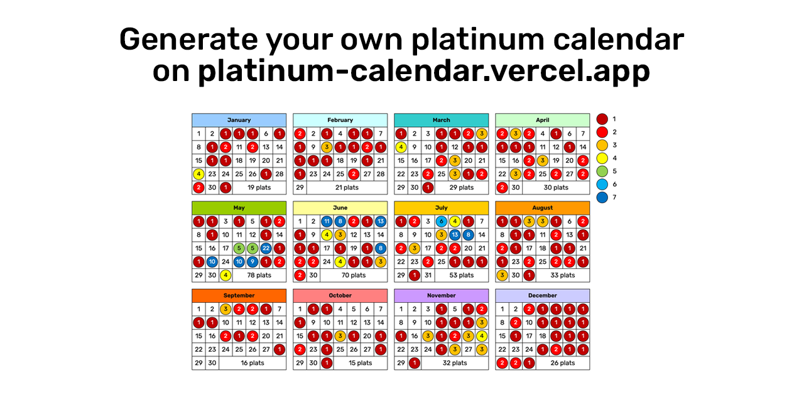

# Platinum Calendar

This web app allows you to visualize your progress by generating a custom calendar that displays the exact days you earned your platinum trophies throughout the year. Track how many platinum trophies you've collected day by day, and watch your calendar fill up as you progress toward completing it. Whether you're aiming for a full year of platinum trophies or just want to review your trophy milestones, this app helps you stay motivated on your journey to trophy mastery.

[Try it now!](https://platinum-calendar.vercel.app/)

